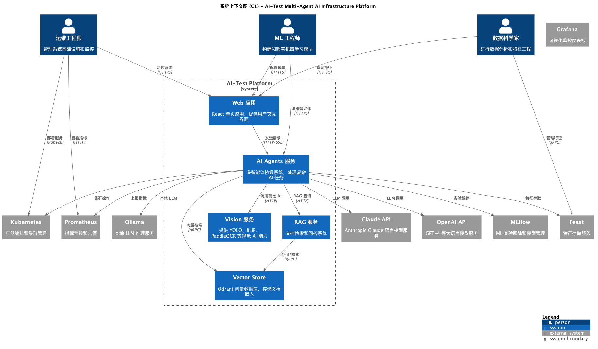
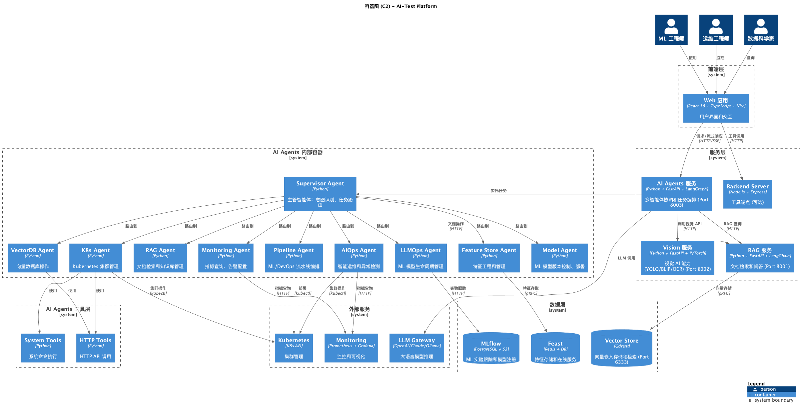
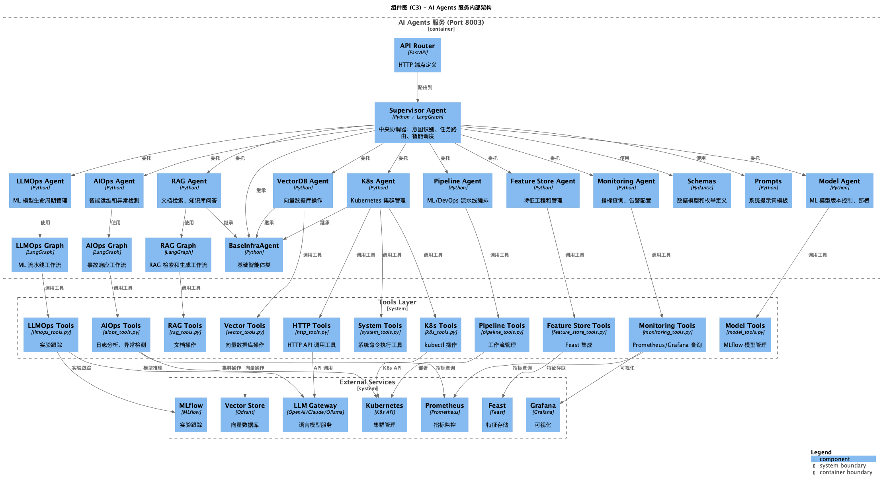
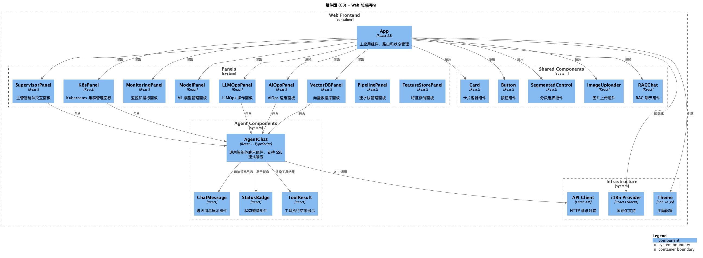
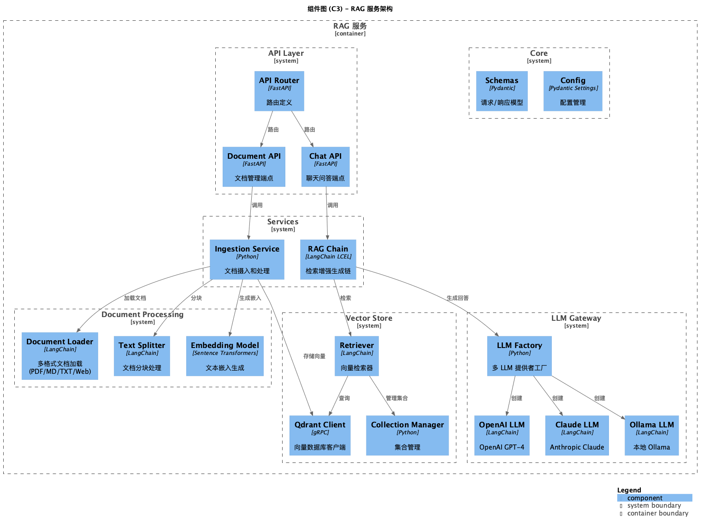

# C4 Model Documentation

本文档使用 C4 模型架构描述方法，详细展示系统的不同抽象层次。

## C4 层次概述

| 层次 | 名称 | 描述 |
| --- | --- | --- |
| C1 | 系统上下文图 (Context) | 显示整个系统及其用户/外部系统的关系 |
| C2 | 容器图 (Container) | 显示应用的技术架构和主要容器 |
| C3 | 组件图 (Component) | 显示每个容器的组件结构 |

## 图表文件

### C1 - 系统上下文图

- **文件**: `context.puml`
- **内容**: 展示 AI-Test Platform 与外部用户、外部系统的交互
- **使用者**: 业务涉众、技术决策者



### C2 - 容器图

- **文件**: `container.puml`
- **内容**: 展示前端、服务层、AI Agents 内部架构、数据层的技术选型
- **使用者**: 架构师、开发团队



### C3 - 组件图

| 文件 | 描述 | 主要组件 |
| --- | --- | --- |
| `component-ai-agents.puml` | AI Agents 服务内部架构 | Supervisor Agent, K8s Agent, VectorDB Agent, RAG Agent, LLMOps Agent, AIOps Agent, Pipeline Agent, Feature Store Agent, Monitoring Agent, Model Agent, LangGraph Workflows, Tools (HTTP, System) |
| `component-frontend.puml` | Web 前端组件结构 | App, Panels (Supervisor/K8s/Monitoring/etc), Agent Components |
| `component-rag-service.puml` | RAG 服务内部架构 | Document API, Chat API, Ingestion Service, RAG Chain, Embedding, Vector Store |







## 查看图表

### 方法 1: PlantUML Online Editor

1. 访问 [PlantUML Online Editor](https://www.plantuml.com/plantuml/uml/)
2. 粘贴 `.puml` 文件内容
3. 点击 "Submit" 渲染图表

### 方法 2: IDE 插件

**VS Code / Cursor:**

- 安装 "PlantUML" 扩展
- 右键 `.puml` 文件选择 "Preview Current Diagram"

**IntelliJ IDEA:**

- 安装 "PlantUML Integration" 插件

### 方法 3: 命令行渲染

```bash
# 安装 PlantUML
brew install plantuml  # macOS
# 或
sudo apt install plantuml  # Ubuntu/Debian

# 创建输出目录
mkdir -p png

# 渲染所有 PUML 文件为 PNG
plantuml -o png *.puml

# 查看生成的图片
ls -la png/
```

生成的文件会放在 `png/` 目录：
- `context.png` - 系统上下文图 (C1)
- `container.png` - 容器图 (C2)
- `component-ai-agents.png` - AI Agents 组件图 (C3)
- `component-frontend.png` - 前端组件图 (C3)
- `component-rag-service.png` - RAG 服务组件图 (C3)

## 系统架构概览

```
┌─────────────────────────────────────────────────────────────────────────────┐
│                              用户层                                          │
│    ML 工程师 ●  运维工程师 ●  数据科学家 ●  开发人员                         │
└─────────────────────────────────────────────────────────────────────────────┘
                                    │
                                    ▼
┌─────────────────────────────────────────────────────────────────────────────┐
│                           AI-Test Platform                                  │
├─────────────────────────────────────────────────────────────────────────────┤
│                                                                             │
│  ┌─────────────────────────────────────────────────────────────────────┐   │
│  │                         前端层 (React)                               │   │
│  │  Web App ─┬─ SupervisorPanel ── AgentChat ── ChatMessage         │   │
│  │            ├─ K8sPanel                                             │   │
│  │            ├─ VectorDBPanel                                        │   │
│  │            ├─ MonitoringPanel                                      │   │
│  │            ├─ ModelPanel / LLMOpsPanel                             │   │
│  │            ├─ AIOpsPanel                                           │   │
│  │            ├─ RAGPanel                                             │   │
│  │            ├─ PipelinePanel                                        │   │
│  │            └─ FeatureStorePanel                                    │   │
│  └─────────────────────────────────────────────────────────────────────┘   │
│                                    │                                        │
│                                    ▼                                        │
│  ┌─────────────────────────────────────────────────────────────────────┐   │
│  │                    AI Agents 服务层 (LangGraph)                       │   │
│  │                         Port: 8003                                  │   │
│  │                                                                       │   │
│  │  ┌───────────────────────────┐                                        │   │
│  │  │    Supervisor Agent      │ ◄── 主管智能体 (中央协调器)             │   │
│  │  │  (意图识别 → 任务路由)    │                                        │   │
│  │  └───────────┬───────────────┘                                        │   │
│  │              │                                                         │   │
│  │  ┌───────────┼───────────┬───────────┬───────────┬───────────┐       │   │
│  │  ▼           ▼           ▼           ▼           ▼           ▼       │   │
│  │ ┌─────┐ ┌───────┐ ┌────────┐ ┌────────┐ ┌────────┐ ┌──────────┐    │   │
│  │ │K8s  │ │VecDB  │ │  RAG   │ │LLMOps  │ │ AIOps  │ │Pipeline  │    │   │
│  │ │Agent│ │Agent  │ │ Agent  │ │ Agent  │ │ Agent  │ │  Agent   │    │   │
│  │ └──┬──┘ └──┬───┘ └───┬────┘ └───┬────┘ └───┬────┘ └───┬──────┘    │   │
│  │    │        │         │          │          │          │            │   │
│  │    └────────┴─────────┴──────────┴──────────┴──────────┴────────────┤   │
│  │                              │                                         │   │
│  │  ┌───────────────────────────┼───────────────────────────┐            │   │
│  │  │                    Tools Layer                       │            │   │
│  │  │  HTTP Tools │ System Tools │ K8s Tools │ Monitoring  │            │   │
│  │  └──────────────────────────────────────────────────────┘            │   │
│  └─────────────────────────────────────────────────────────────────────┘   │
│                                    │                                        │
│          ┌─────────────────────────┼─────────────────────────┐              │
│          ▼                         ▼                         ▼              │
│  ┌───────────────┐      ┌─────────────────┐      ┌─────────────────┐       │
│  │Vision Service │      │   RAG Service  │      │ Backend Server  │       │
│  │ (YOLO/BLIP)   │      │ (LangChain/Qdr)│      │   (Express)     │       │
│  │   Port 8002   │      │   Port 8001    │      │                 │       │
│  └───────────────┘      └────────┬────────┘      └─────────────────┘       │
│                                   │                                         │
│                                   ▼                                         │
│                          ┌───────────────┐                                  │
│                          │ Vector Store  │                                  │
│                          │   (Qdrant)    │                                  │
│                          │  Port 6333    │                                  │
│                          └───────────────┘                                  │
└─────────────────────────────────────────────────────────────────────────────┘
                                    │
                                    ▼
┌─────────────────────────────────────────────────────────────────────────────┐
│                          外部集成服务                                        │
│  ┌──────────┐  ┌──────────┐  ┌──────────┐  ┌──────────┐  ┌──────────┐    │
│  │ OpenAI   │  │ Claude   │  │ Ollama   │  │ MLflow   │  │ Feast    │    │
│  │  API     │  │   API    │  │ (Local)  │  │          │  │          │    │
│  └──────────┘  └──────────┘  └──────────┘  └──────────┘  └──────────┘    │
│                                                                             │
│  ┌──────────┐  ┌──────────┐  ┌──────────┐                                  │
│  │  K8s     │  │Prometheus│  │ Grafana  │                                  │
│  │          │  │          │  │          │                                  │
│  └──────────┘  └──────────┘  └──────────┘                                  │
└─────────────────────────────────────────────────────────────────────────────┘
```

## 智能体路由配置

Supervisor Agent 根据用户输入的关键词路由到相应的专业智能体：

```
用户输入 → Supervisor Agent → 关键词匹配 → 专业智能体

路由关键词映射:
├── "vector", "embedding", "search"     → VectorDB Agent
├── "k8s", "kubernetes", "pod", "cluster" → K8s Agent
├── "monitor", "metric", "alert"         → Monitoring Agent
├── "model", "deploy", "ml", "version"  → Model Agent
├── "rag", "document", "knowledge"       → RAG Agent
├── "llmops", "train", "evaluate"       → LLMOps Agent
├── "feature", "materialize"             → Feature Store Agent
├── "pipeline", "workflow", "dag"        → Pipeline Agent
└── "aiops", "anomaly", "incident"       → AIOps Agent
```

## 工具层架构

### HTTP Tools (`http_tools.py`)

提供通用的 HTTP API 调用能力：

- **http_request**: 发送 HTTP 请求到外部 API
  - 支持 GET/POST/PUT/DELETE 方法
  - 可配置请求头和请求体
  - 自动处理 JSON 响应

### System Tools (`system_tools.py`)

提供本地系统命令执行能力：

- **execute_command**: 执行 shell 命令
  - 支持 kubectl, docker, git 等工具
  - 30 秒超时保护
  - 返回标准输出/错误

### Specialized Tools

| 工具文件 | 所属 Agent | 功能描述 |
| --- | --- | --- |
| `k8s_tools.py` | K8s Agent | Kubernetes API 操作 |
| `vector_tools.py` | VectorDB Agent | 向量数据库操作 |
| `monitoring_tools.py` | Monitoring Agent | Prometheus/Grafana 查询 |
| `model_tools.py` | Model Agent | MLflow 模型管理 |
| `llmops_tools.py` | LLMOps Agent | 实验跟踪 |
| `aiops_tools.py` | AIOps Agent | 日志分析、异常检测 |
| `rag_tools.py` | RAG Agent | 文档操作 |
| `pipeline_tools.py` | Pipeline Agent | 工作流管理 |
| `feature_store_tools.py` | Feature Store Agent | Feast 集成 |

## 技术栈汇总

| 层级 | 技术 | 用途 |
| --- | --- | --- |
| **前端** | React 18, TypeScript, Vite | UI 框架 |
| **AI Agents** | Python, FastAPI, LangChain, LangGraph | 智能体编排 |
| **Agent Tools** | HTTP, System Commands, K8s API | 工具执行 |
| **RAG** | FastAPI, LangChain, Qdrant | 检索增强生成 |
| **Vision** | FastAPI, PyTorch, YOLO, BLIP | 视觉 AI |
| **LLM** | OpenAI, Anthropic Claude, Ollama | 语言模型 |
| **MLOps** | MLflow | 实验跟踪 |
| **Features** | Feast | 特征存储 |
| **Infra** | Kubernetes, Prometheus, Grafana | 基础设施 |

## 服务端口汇总

| 服务 | 端口 | 描述 |
| --- | --- | --- |
| Web Frontend | 5173 | React 开发服务器 |
| Backend Server | 3000-3001 | Express.js 服务 |
| AI Agents | 8003 | 多智能体服务 |
| Vision Service | 8002 | 视觉 AI 服务 |
| RAG Service | 8001 | 文档检索服务 |
| Qdrant | 6333 | 向量数据库 |
| Ollama | 11434 | 本地 LLM (可选) |
